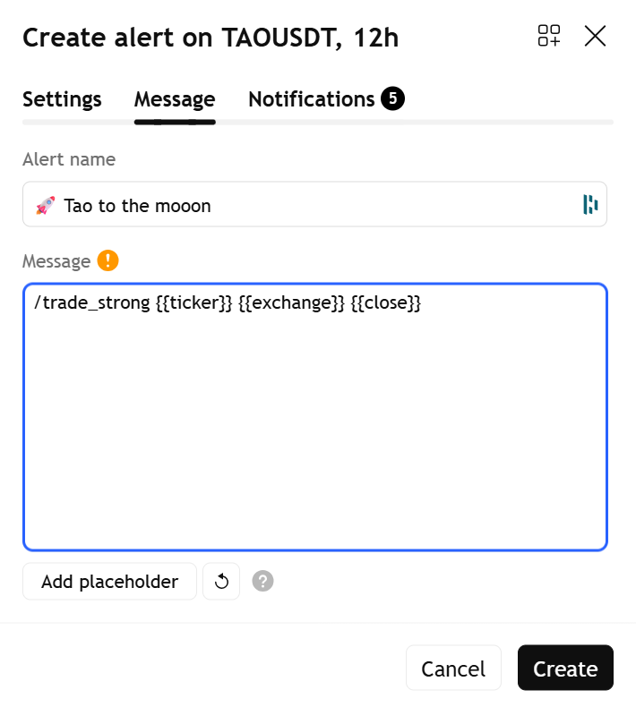
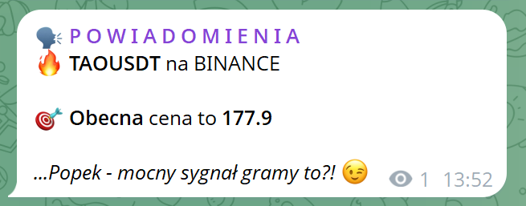

# 🗣 TradingView Alerts to Telegram, Discord or Slack

A self-hosted webhook server that receives [TradingView](https://tradingview.com) alerts and forwards them to **Telegram**, **Discord**, and **Slack**. Comes with a password-protected admin dashboard for managing configuration through the browser.

Built with FastAPI + Streamlit, deployed via Docker Compose.

---

## Features

- **Multi-channel alerts** — forward TradingView signals to Telegram (up to 2 groups), Discord, and Slack simultaneously
- **Alias system** — define short commands like `/spot {{ticker}} {{exchange}} {{close}}` instead of pasting complex JSON in TradingView
- **Admin dashboard** — configure channels, manage aliases, send test alerts, view logs — all from the browser
- **Dynamic channel override** — redirect any alert to a different Telegram/Discord/Slack channel directly from the TradingView alert payload
- **TradingView variables** — supports `{{close}}`, `{{exchange}}`, `{{ticker}}`, `{{volume}}` and all other TradingView placeholders
- **Security** — HMAC key validation, rate limiting, body size limits, SSRF protection, brute-force lockout, security headers
- **Docker-ready** — two containers (webhook + dashboard), runs behind Cloudflare Tunnel or any reverse proxy

---

## Architecture

```
TradingView Alert
       │
       ▼
  POST /webhook ──► Key validation ──► Alias/Template expansion ──► Send to channels
       │                                                                │
       │                                                    ┌───────────┼───────────┐
       │                                                    ▼           ▼           ▼
       │                                                Telegram    Discord     Slack
       │
  Admin Dashboard (Streamlit :8501)
       │
       └──► Configure .env ──► POST /reload-config ──► Hot-reload settings
```

| File | Role |
|---|---|
| `main.py` | FastAPI app — webhook endpoints, rate limiting, middleware |
| `handler.py` | Dispatches alerts to Telegram/Discord/Slack |
| `config.py` | Settings management — thread-safe singleton with hot-reload |
| `aliases.py` | Alias system — `/shortcut {var1} {var2}` expansion |
| `auth.py` | Dashboard authentication — HMAC-signed session tokens |
| `Dashboard.py` | Streamlit entry point — credential status overview |
| `pages/` | Dashboard pages: Configuration, Channels, Aliases, Test, Logs |

---

## Quick Start

### 1. Clone the repository

```bash
git clone https://github.com/popek1990/Tradingview.git
cd Tradingview
```

### 2. Create the `.env` file

```bash
cp .env.example .env
```

Edit `.env` with your values:

```env
SEC_KEY=your_secret_key_here          # Must match "key" in TradingView alerts
DASHBOARD_PASSWORD=your_password      # Password for the admin dashboard

# Telegram (get token from @BotFather)
SEND_ALERTS_TELEGRAM=True
TG_TOKEN=123456789:ABCdefGHIjklMNOpqrSTUvwxYZ
CHANNEL=-10018645640

# Discord (optional)
SEND_ALERTS_DISCORD=False
DISCORD_WEBHOOK=https://discord.com/api/webhooks/...

# Slack (optional)
SEND_ALERTS_SLACK=False
SLACK_WEBHOOK=https://hooks.slack.com/services/...
```

> **Tip:** Generate a secure key: `python3 -c "import secrets; print(secrets.token_urlsafe(32))"`

### 3. Start with Docker Compose

```bash
docker compose up -d --build
```

After launch:
- **Webhook:** `http://localhost:80` (needs to be publicly accessible for TradingView)
- **Dashboard:** `http://localhost:8501` (LAN accessible, password-protected)

---

## Getting a Telegram Bot Token

1. Open Telegram and search for **@BotFather**
2. Send `/newbot` and follow the prompts (choose a name and username)
3. BotFather will reply with a token like: `110201543:AAHdqTcvCH1vGWJxfSeofSAs0K5PALDsaw`
4. Paste this token as `TG_TOKEN` in your `.env`
5. **Add the bot to your Telegram group** and send any message there
6. Go to the **Channels** page in the admin dashboard — the bot will auto-detect your groups

---

## Exposing the Webhook to the Internet

TradingView sends alerts from its cloud servers, so your webhook **must be reachable from the internet** on port **80** (HTTP) or **443** (HTTPS). TradingView does not support custom ports.

### Option A: Cloudflare Tunnel (recommended)

Free, secure, no need to open ports on your router.

```bash
cloudflared tunnel login
cloudflared tunnel create tradingview
cloudflared tunnel route dns tradingview webhook.yourdomain.com
cloudflared tunnel run --url http://localhost:80 tradingview
```

Then in TradingView, set webhook URL to: `https://webhook.yourdomain.com/webhook`

### Option B: Port forwarding

1. Forward **external port 80 → your server's local IP, port 80 (TCP)** on your router
2. Find your public IP: `curl ifconfig.me`
3. In TradingView, set webhook URL to: `http://<YOUR_PUBLIC_IP>/webhook`

> If your ISP assigns a dynamic IP, use a free DDNS service like [DuckDNS](https://www.duckdns.org).

### Option C: VPS

Rent a VPS ([Hetzner](https://www.hetzner.com/cloud), [DigitalOcean](https://www.digitalocean.com), [Oracle Cloud Free Tier](https://www.oracle.com/cloud/free/)), install Docker, clone this repo, and run `docker compose up -d`.

---

## Setting Up TradingView Alerts

### Method 1: Alias (recommended)

Aliases let you use short commands instead of JSON. Define them in the dashboard under **Aliases**, then use them in TradingView's alert **Message** field:

```
/spot {{ticker}} {{exchange}} {{close}}
```



TradingView substitutes `{{ticker}}`, `{{exchange}}`, `{{close}}` with real values before sending. The webhook receives something like `/spot BTCUSDT BINANCE 68000` and expands it using the alias template.



**Webhook URL setup:**
- Set the URL to: `http://yourdomain.com/webhook/your_secret_key`
- The key is passed in the URL, so the message field only needs the alias command

### Method 2: JSON payload

Set webhook URL to `http://yourdomain.com/webhook` and the message to:

```json
{
  "key": "your_secret_key",
  "msg": "Signal *#{{ticker}}* at price `{{close}}`"
}
```

### Method 3: JSON with channel override

Override default channels per alert:

```json
{
  "key": "your_secret_key",
  "msg": "VIP alert: {{ticker}} at {{close}}",
  "telegram": "-10018645640",
  "discord": "https://discord.com/api/webhooks/...",
  "slack": "T00000000/B00000000/XXXXXXXXXXXXX"
}
```

---

## API Endpoints

| Endpoint | Method | Description |
|---|---|---|
| `/webhook` | POST | Receive alerts (key in JSON body) |
| `/webhook/{key}` | POST | Receive alerts (key in URL) |
| `/health` | GET | Health check |
| `/reload-config` | POST | Hot-reload settings from `.env` (internal network only) |

---

## Docker Setup

The project runs two containers:

| Container | Port | Purpose |
|---|---|---|
| `webhook` | `127.0.0.1:80 → 1990` | FastAPI webhook server |
| `dashboard` | `0.0.0.0:8501 → 8501` | Streamlit admin panel |

Both containers:
- Run as non-root user (`appuser`)
- Have `no-new-privileges` security option
- Share `.env`, `aliases.json`, and a `logs` volume

### Volumes (bind mounts)

| File | Purpose |
|---|---|
| `.env` | Configuration (read-only for webhook, read-write for dashboard) |
| `aliases.json` | Alias definitions |
| `templates.json` | Message templates |
| `logs/` | Shared log directory (named volume) |

---

## Running Without Docker

```bash
pip install -r requirements.txt

# Terminal 1: Webhook server
uvicorn main:app --host 0.0.0.0 --port 80

# Terminal 2: Admin dashboard
streamlit run Dashboard.py
```

---

## Running Tests

```bash
pytest              # all tests
pytest -v           # verbose
pytest -k "test_telegram"  # by name
```

---

## Security

- **Key validation** — constant-time comparison using `hmac.compare_digest` on SHA-256 hashes
- **Rate limiting** — 30 requests/minute per IP via slowapi (uses `CF-Connecting-IP` behind Cloudflare)
- **Body size limit** — 10KB max (checks both `Content-Length` header and actual body)
- **SSRF protection** — Discord/Slack webhook URLs validated for scheme, hostname, and path prefix
- **Security headers** — HSTS, CSP, X-Frame-Options, X-Content-Type-Options
- **Brute-force protection** — per-IP lockout on dashboard login
- **Internal endpoints** — `/reload-config` restricted to RFC 1918 private networks
- **Non-root containers** — webhook runs as `appuser` with `no-new-privileges`
- **Docs disabled** — `/docs` and `/redoc` are disabled in production

---

## Tech Stack

- **Python 3.12+**
- **FastAPI** + **Uvicorn** — async webhook server
- **Streamlit** — admin dashboard
- **python-telegram-bot 13.6** — Telegram integration (sync API, called via `asyncio.to_thread`)
- **discord-webhook** — Discord integration
- **pydantic-settings** — configuration management
- **slowapi** — rate limiting
- **Docker Compose** — containerized deployment

---

## License

MIT
